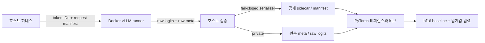

# feat: vLLM 비양자화 parity 기준선 구축

## 개요

PyTorch bf16 레퍼런스와 vLLM v0.26.0 bf16을 동일한 token IDs로 비교해,
양자화가 없는 상태에서도 발생하는 백엔드 차이를 기준선으로 고정한다. 본 측정 전에
raw-logits 공개 API, Gemma 4 텍스트 전용 로드, 호스트↔컨테이너 격리, 공개 메타데이터 경계,
재현성 manifest를 먼저 검증한다.

이 계획의 출발점과 공개 설계 결정 D1~D9는 [`README.md`](README.md)다.

## 문제 정의

현재 하네스는 PyTorch 레퍼런스를 저장할 수 있지만 vLLM은 별도 Docker 환경에 있고,
기존 `BackendAdapter`는 프로세스 밖 runner를 다루지 않는다. vLLM이 반환한 값이 정말 raw logits인지,
멀티모달 체크포인트에서 텍스트 tower만 로드됐는지, 결과를 만든 코드와 환경을 나중에
복원할 수 있는지를 독립적으로 증명해야 한다. 이 증명 없이 만든 parity 수치는 후속 양자화·llama.cpp·
OpenVINO 결과의 기준으로 쓸 수 없다.

## 요구사항 추적

- **R1.** vLLM v0.26.0의 공개 API만으로 전체 vocab fp32 raw logits를 얻고 raw log-probability와 수학적으로 구별한다.
- **R2.** `google/gemma-4-E2B-it`에서 텍스트 전용 모델만 로드됐음을 클래스·파라미터·타워 구성으로 검증한다.
- **R3.** 호스트 하네스와 Docker 내 vLLM을 파일 교환 runner로 연결하고 서버 API·내부 hook에 의존하지 않는다.
- **R4.** manifest와 sidecar에 공통 fail-closed 공개 경계를 적용하고, 원문 meta는 권한·보존 규칙에 따라 비공개로 다룬다.
- **R5.** 모델·토크나이저·이미지·의존성·GPU·코드 tree·dirty diff·semantics를 측정 manifest에 고정한다.
- **R6.** 원본 프롬프트 5종과 256/512/1024/1849 길이 사다리를 구분해 bf16 baseline을 만든다.
- **R7.** 2048 문맥을 본편으로 보장하고, 4096은 무절단·무OOM을 실측한 경우에만 확장한다.
- **R8.** 더미 어댑터로 계약 재사용성을 먼저 검증한 뒤 D9 동결 기준을 남긴다.
- **R9.** eager↔SDPA 원본 5종 비교와 외부 대조 또는 독립 수치 oracle로 PyTorch 레퍼런스의 잠정 상태를 해제한다.
- **R10.** README만 따라 실제 GPU baseline을 생성하는 경로와 캐시된 공개 결과를 무GPU로 재생하는 경로를 구분해 제공한다.

## 범위 경계

- 양자화 체크포인트 생성과 정확도 매트릭스는 이 계획의 범위가 아니다.
- llama.cpp와 OpenVINO 어댑터는 이 계획에서 구현하지 않는다.
- OpenAI 호환 서버 API와 vLLM 내부 hook은 raw logits 계약에 사용하지 않는다.
- 4096 문맥은 필수 완료 조건이 아니다.
- 스파이크 수치는 baseline으로 재사용하지 않는다.

## 조사 결과와 따를 패턴

- `harness/adapters/base.py`: token IDs 입력, 컨텍스트 매니저, 로드 후 바이트 결정론성 검사를 유지한다.
- `harness/adapters/pytorch.py`: 요청값과 실제 적용값을 함께 meta에 남기고, 가중치 누락을 fail-closed로 다룬다.
- `harness/cache.py`: `SEMANTICS_VERSION`이 포함된 경로와 `.npy` + JSON sidecar 구조를 유지한다.
- `harness/reference.py`: 한 번의 모델 로드에서 프롬프트 측정과 구조 정보를 함께 수집하는 패턴을 따른다.
- `tests/test_harness.py`: 별도 테스트 프레임워크 없이 실패 가능한 자체 검사를 늘린다.
- 관련 `docs/solutions/` 학습 문서는 없다. 외부 계약은 vLLM v0.26.0의 `raw_logits`, `raw_logprobs`, 전체 vocab `logprobs=-1`, 재현성 제약을 기준으로 삼는다.

## 핵심 기술 결정

- **파일 교환 runner**: 호스트가 입력 아티팩트를 쓰고, 컨테이너가 vLLM을 실행해 출력 아티팩트를 쓴다. 호스트 어댑터가 검증·캐시를 소유한다.
- **텍스트 전용 로드**: Gemma 4 architecture override를 명시하고 effective class, 파라미터 수, 멀티모달 tower 미로드를 필수 증거로 남긴다.
- **raw 의미 oracle**: 알려진 합성 logits에서 raw 보존을 먼저 검증하고, target 모델에서 raw logits·raw log-probability·PyTorch raw logits 세 결과를 대조한다.
- **공통 fail-closed serializer**: manifest와 sidecar가 같은 허용목록·금지 패턴 검사를 사용한다. 알 수 없는 필드는 버린 뒤 진행하지 않고 직렬화 전체를 실패시킨다.
- **재현성 연결**: 각 sidecar는 manifest hash를 참조하고, manifest는 환경과 하네스 코드 상태를 함께 고정한다.
- **비밀 마운트 금지**: 미리 받은 HF cache만 read-only로 컨테이너에 제공하고 인증 토큰은 직접 주입하지 않는다.

## 전체 흐름

> *아래 그림은 검토를 위한 방향성 안내이며 구현 명세가 아니다. 구현자는 그대로 복제할 코드가 아니라 경계와 증거 흐름으로 사용한다.*

## 구현 단위

- [ ] **Unit 1: raw-logits 실행 가능성과 격리 경계 검증**

**목표:** 본편 코드를 늘리기 전에 target 모델·GPU에서 공개 raw-logits API와 파일 runner 경계가 성립하는지 확정한다.

**요구사항:** R1, R2, R3

**의존성:** HF cache에 모델·tokenizer revision이 완전히 받아져 있고, vLLM v0.26.0 이미지가 GPU를 볼 수 있어야 한다.

**파일:**

- 생성: `spikes/vllm_raw_logits.py`
- 생성: `results/spikes/vllm-raw-logits/README.md`
- 수정: `tests/test_harness.py`
- 테스트: `tests/test_harness.py`

**접근:**

- 합성 프롬프트 1종의 token IDs를 호스트 입력으로 삼고, 컨테이너 스파이크가 전체 vocab의 예측 1토큰 raw 값을 파일로 반환하게 한다.
- 커스텀 이미지를 만들지 않고 digest로 고정한 공식 vLLM v0.26.0 이미지를 직접 사용한다.
- 입력 아티팩트·HF cache는 필요한 하위 경로만 read-only로, 출력은 실행마다 새 빈 디렉터리 하나만 writable로 마운트한다. 저장소 루트·사용자 홈·Docker socket은 마운트하지 않고, 비루트 UID/GID·capability drop·no-new-privileges·캐시 준비 후 네트워크 비활성을 적용한다.
- 텍스트 전용 architecture override를 고정하고 로드 성공, OOM, raw 반환 실패를 서로 다른 종료 상태로 남긴다.
- vLLM upstream sampler의 알려진 합성 logits 예제를 재현해 `raw_logits`가 정규화하지 않고 입력 절대값을 그대로 보존하는지 검증한다.
- target 모델에서 raw logits와 raw log-probability가 동일하지 않고 둘의 차이가 vocab 전체에서 상수며, raw log-probability만 정규화되는지 확인한다. 동일 token IDs의 PyTorch raw logits과도 절대 스케일을 대조한다.
- vocab 범위, fp32·유한성, argmax, 2회 바이트 결정론성을 함께 검증한다.
- 이 단위의 수치는 `results/logits/`로 옮기지 않는다.
- Docker stdout·stderr·예외 원문은 `0600` 비공개 raw 로그에 두고, 공개 스파이크 README는 열거형 종료 상태·검증 결과·허용 meta만 사용한다.

**패턴:** `harness/adapters/pytorch.py`의 fail-closed 로드 검증과 requested/effective meta 분리.

**테스트 시나리오:**

- 행복 경로: 알려진 합성 logits의 절대값이 raw mode에서 보존되고, target 모델의 전체 vocab raw logits과 raw log-probability는 정규화 관계를 만족하면서 서로 동일하지 않다.
- 오류 경로: 두 API mode가 모두 동일한 정규화 벡터를 반환하면 관계식이 맞더라도 실패한다.
- 오류 경로: 일부 top-k만 반환되거나 token ID가 비면 vocab 불완전으로 실패한다.
- 오류 경로: 실제 모델 클래스가 텍스트 전용이 아니거나 멀티모달 tower가 로드되면 스파이크를 실패한다.
- 통합: 컨테이너 내 `nvidia-smi`와 실제 샘플링 경로가 GPU 사용을 증명하고 파일 입출력이 순환한다.
- 보안 경계: stdout·stderr에 인증 문자열·환경변수·절대 경로를 주입해도 공개 README·sidecar에는 등장하지 않는다.

**검증:** 타임박스 2시간 안에 Go 증거가 남고, 서버 결과를 `sync.sh pull-results`로 회수해 공개 README가 로컬에서도 확인된다. target 모델에서 내부 hook이 필요하거나 전체 vocab raw logits를 받지 못하면 **No-Go로 종료**하고 뒤 단위를 시작하지 않는다.

- [ ] **Unit 2: 어댑터 계약과 공개 메타데이터 경계 동기화**

**목표:** 프로세스 밖 runner를 수용하면서 원문 정보는 보존하고 공개 정보는 안전하게 제한하는 공통 계약을 만든다.

**요구사항:** R3, R4

**의존성:** Unit 1 Go

**파일:**

- 생성: `harness/metadata.py`
- 수정: `harness/adapters/base.py`
- 수정: `harness/cache.py`
- 수정: `tests/test_harness.py`
- 테스트: `tests/test_harness.py`

**접근:**

- `generate()`를 필수 추상 계약에서 제거하되 기존 구현의 편의 메서드로는 남길 수 있게 한다.
- 원문 meta와 공개 manifest·sidecar를 서로 다른 저장 경로로 분리한다. 원문은 `0600`, gitignore, 최대 30일 보존을 적용한다.
- 공통 serializer는 허용된 키만 받고 인증·환경변수·절대 경로·원문 로그 후보가 있으면 아예 쓰기를 실패한다.
- `save_logits()`는 배열·manifest·공개 meta 전체를 먼저 검증한 뒤 `.npy`와 sidecar를 임시 파일에 쓰고 최종 경로로 원자적 교체한다. 중간 실패는 임시·고아 파일을 정리한다.
- `have_logits()`와 `load_logits()`는 logits·유효한 sidecar·manifest hash가 모두 있을 때만 성공하며 `.npy` 단독 파일을 캐시로 인정하지 않는다.
- 공개 token IDs는 공개·합성 프롬프트에만 허용하고, 그 외 입력은 공개 식별자만 남긴다.
- 원문 meta 저장 시각을 기록하고 Unit 5 마감에서 검수 완료 또는 30일 중 먼저 오는 기한을 넘긴 파일이 없는지 검사하는 책임을 둔다.

**패턴:** `harness/cache.py`의 버전 경로와 `harness/adapters/pytorch.py`의 원문 requested/effective 보존.

**테스트 시나리오:**

- 행복 경로: 허용된 모델·백엔드·버전·커널·메모리·hash만 든 manifest와 sidecar가 생성된다.
- 오류 경로: `HF_TOKEN`, 환경변수 덤프, 절대 경로, 예상하지 못한 key 중 하나가 있으면 파일을 생성하지 않는다.
- 경계: 합성 프롬프트는 token IDs가 공개되고 비공개 입력은 token IDs가 공개되지 않는다.
- 회귀: 원문 meta를 비공개로 보존해도 공개 sidecar의 기존 캐시 정보를 읽을 수 있다.
- 오류 경로: sidecar 직렬화가 거부되거나 두 파일 중 하나의 교체가 실패해도 완성된 `.npy` 단독 캐시가 남지 않는다.

**검증:** 자체 검사가 허용목록과 금지 패턴을 둘 다 증명하고, 샘플 공개 파일에 비밀·절대 경로가 없다.

- [ ] **Unit 3: 재현성 manifest와 레퍼런스 검증 동결**

**목표:** 측정값을 만든 환경·코드·입력을 복원할 수 있게 하고 2단계 레퍼런스를 잠정 상태에서 해제한다.

**요구사항:** R4, R5, R9

**의존성:** Unit 2

**파일:**

- 생성: `harness/manifest.py`
- 생성: `configs/vllm-bf16.json`
- 수정: `harness/reference.py`
- 수정: `results/reference/README.md`
- 수정: `tests/test_harness.py`
- 테스트: `tests/test_harness.py`

**접근:**

- 이미지는 tag가 아니라 digest, HF 모델과 tokenizer는 full commit, Python 의존성은 전이 버전·hash로 고정한다.
- GPU·driver·CUDA, seed·엔진 인자, 공개 레포 commit/tree, dirty diff hash, `SEMANTICS_VERSION`을 한 manifest에 기록한다. 이 단위는 manifest schema·생성기와 **레퍼런스 검증용 manifest**를 완성하며, 아직 없는 vLLM 본편 코드의 상태를 선행 동결하지 않는다.
- eager↔SDPA 원본 5종 비교를 별도 결과 루트에 남기고, 외부 benchmark는 정확한 평가 셋·설정이 공개된 경우에만 점수 재현 관문으로 사용한다.
- 공개 수치와 정확한 실행 조건을 맞출 수 없으면 산티 체크로만 표시하고 구조 검증만으로 레퍼런스를 동결하지 않는다. 공식 멀티모달 상위 모델을 같은 공개 짧은 입력·정밀도·attention 조건으로 독립 로드하고, 이의 text logits와 텍스트 전용 레퍼런스 logits를 대조하는 수치 oracle를 대체 완료 관문으로 사용한다.

**패턴:** `harness/reference.py`의 원본 5종 실행과 `results/reference/README.md`의 실측값·증거 분리.

**테스트 시나리오:**

- 행복 경로: 키 순서와 시각이 달라도 동일한 manifest 내용은 동일한 hash를 낸다.
- 변경 경로: tree, dirty diff, semantics, 엔진 인자 중 하나가 바뀌면 manifest hash도 바뀐다.
- 오류 경로: tag만 있는 이미지, 부분 HF revision, hash 없는 의존성은 manifest 동결을 거부한다.
- 통합: 새 sidecar의 manifest hash가 실제 manifest 내용과 일치하고 잘못된 hash로는 결과를 읽지 않는다.

**검증:** `results/reference/README.md`에 eager↔SDPA·외부 대조 또는 독립 수치 oracle·loader 검증 결과와 manifest hash가 기록되고, 서버 결과를 `sync.sh pull-results`로 회수한 후 레퍼런스가 더 이상 잠정으로 표기되지 않는다.

- [ ] **Unit 4: vLLM 어댑터·runner와 2K bf16 baseline 완성**

**목표:** 검증된 스파이크를 재사용 가능한 어댑터 경로로 옮기고 PyTorch↔vLLM bf16 비양자화 기준선을 만든다.

**요구사항:** R3, R5, R6, R7, R10

**의존성:** Unit 3. `max_model_len=2048`의 실제 KV 예산 검증은 이 단위의 첫 preflight다.

**파일:**

- 생성: `harness/adapters/vllm.py`
- 생성: `harness/vllm_runner.py`
- 생성: `harness/parity.py`
- 생성: `results/baseline/README.md`
- 수정: `harness/prompts.py`
- 수정: `tests/test_harness.py`
- 테스트: `tests/test_harness.py`

**접근:**

- 호스트 어댑터는 runner 입출력·종료 상태를 검증하고 기존 `BackendAdapter`의 로드·로짓·meta·unload 의미를 유지한다.
- runner는 vLLM import·모델 상주·샘플링만 소유하고 비교·판정·공개 직렬화를 소유하지 않는다.
- 첫 preflight는 1849토큰 입력을 `max_model_len=2048`로 무절단·무OOM 처리하고 vLLM이 보고한 KV 블록·실측 메모리를 남긴다. 이 preflight가 실패하면 baseline을 시작하지 않는다.
- 어댑터·runner·parity·prompt 코드가 확정된 뒤 **baseline 실행 직전**에 새 baseline manifest를 생성하고 모든 baseline sidecar가 그 hash를 참조하게 한다.
- 실행마다 새 전용 출력 디렉터리와 고정 파일명만 허용한다. 호스트는 canonical path가 그 디렉터리 안인지 확인하고 symlink·device·FIFO를 거부하며 regular file만 no-follow 방식으로 연다. logits·meta 크기 상한을 확인한 뒤에만 파싱하고 검증된 파일만 최종 cache로 원자 이동한다.
- 원본 5종 회귀군과 길이 사다리 4행을 별도 ID로 실행하고, 원본 long과 사다리 1849의 역할을 리포트에서 구분한다.
- 2048은 필수 본편, 4096은 조건부 확장으로 실행한다. 확장 실패는 본편 실패로 전파하지 않는다.
- parity는 단일 요청·eager·prefix cache off·고정 seed로 실행하고, 후속 성능 측정 설정과 분리한다.
- README에 GPU 전체 재현 경로와 무GPU 공개 아티팩트 replay 경로를 나눠 적는다. 전자는 GPU·VRAM·모델 접근권·예상 시간·저장공간·입출력·종료 상태, 후자는 재생이 보장하는 범위와 실제 모델을 다시 돌리지 않는다는 한계를 명시한다.

**패턴:** `harness/adapters/base.py`의 lifecycle과 `harness/reference.py`의 한 번 로드·복수 프롬프트 실행.

**테스트 시나리오:**

- 행복 경로: 원본 5종과 길이 사다리가 동일한 manifest를 참조하는 fp32 1-D vocab logits를 남긴다.
- 경계: 1849토큰 입력이 잘리지 않고 2048 설정에서 동작한다.
- 오류 경로: runner timeout, 불완전 출력, vocab 크기 불일치, manifest hash 불일치는 캐시를 남기지 않고 구체적 종료 상태로 전파한다.
- 보안 경계: 예상 파일명 밖, 출력 디렉터리 밖 path, symlink·특수 파일, 크기 상한 초과 출력을 모두 파싱 전에 거부한다.
- 조건부: 4096에서 OOM이나 잘림이 나도 2048 결과는 유효하다.
- 통합: 어댑터 컨텍스트를 나오면 컨테이너·GPU 자원이 해제되고 다음 PyTorch 또는 vLLM 실행이 상주 모델없이 시작한다.

**검증:** 원본 5종·길이 4행의 상세 parity 표와 2048 KV 설정·실측 메모리가 `results/baseline/README.md`에 남는다. 서버 결과를 `sync.sh pull-results`로 회수하고, 지원 GPU 환경의 깨끗한 clone에서 README의 전체 재현 경로가 표·manifest 연결을 만들며 무GPU clone에서 replay 경로가 공개 결과를 검증한다.

- [ ] **Unit 5: baseline 해석·더미 어댑터·D9 동결**

**목표:** 후속 양자화 결과가 인용할 임계값 입력을 남기고, 계약이 새 백엔드를 받을 수 있음을 동결 전에 증명한다.

**요구사항:** R6, R8

**의존성:** Unit 4 baseline 완료

**파일:**

- 생성: `tests/fixtures/file_runner_adapter.py`
- 생성: `configs/parity-threshold-inputs.json`
- 수정: `results/baseline/README.md`
- 수정: `README.md`
- 수정: `tests/test_harness.py`
- 테스트: `tests/test_harness.py`

**접근:**

- eager↔SDPA와 PyTorch↔vLLM 비양자화 기준선을 **최종 판정이 아닌 임계값 입력**으로 남기고, logits에 정의된 형태별 통제 오차를 주입해 top-1·KL 변화와 연결한다. 정확도 연결과 최종 통과 임계값은 후속 정확도 단계가 이 입력을 소비해 만든다.
- 더미는 운영 어댑터가 아닌 test-local subprocess/file-runner로 둔다. 정상 고정 logits 반환과 함께 timeout·비정상 종료·불완전 파일·unload를 주입하고, 하네스 본체 수정 없이 등록·캐시·비교·오류 전파를 통과하게 한다.
- 더미 검증이 통과한 코드 상태를 D9 동결 기준으로 남기고, 후속 OpenVINO 어댑터가 비교할 본체 파일 목록을 README에 명시한다.
- 로컬 검증 후 `sync.sh push`와 최종 `sync.sh check`로 서버 소스와 동기화됐음을 확인한다.

**패턴:** `_FlakyAdapter`와 cache round-trip 자체 검사를 test-local 파일 runner로 확장하여 본체 계약의 사용자 관점을 검증한다.

**테스트 시나리오:**

- 행복 경로: 더미 어댑터를 추가해도 `base.py`, `compare.py`, `cache.py`의 변경 없이 고정 결과를 저장·비교한다.
- 행복 경로: 통제 오차가 작을 때는 top-1이 유지되고, 오차 형태·크기에 따라 top-1·KL 입력값이 예상대로 변한다.
- 오류 경로: test-local runner의 timeout·비정상 종료·불완전 파일이 각각 캐시 미생성과 구체적 오류로 전파된다.
- 오류 경로: 더미 추가에 본체 수정이 필요하면 D9 동결을 중단하고 계약을 먼저 수정한다.
- 통합: 깨끗한 clone에서 캐시된 예제를 재생하고 더미 어댑터를 하네스 본체 수정 없이 추가할 수 있다.

**검증:** baseline·임계값 입력·test-local file-runner 결과·D9 동결 기준이 서로 링크된다. 최종 `sync.sh pull-results`로 공개 결과를 회수한 뒤 `sync.sh push`를 적용하고 `sync.sh check`가 조용하다.

## 시스템 전체 영향

- **상호작용 그래프:** 호스트 어댑터 → Docker runner → 원문 결과 → 공개 serializer → cache·compare로 이어진다.
- **오류 전파:** runner 실패는 캐시 미생성으로, serializer 실패는 공개 파일 미생성으로, manifest 불일치는 결과 읽기 거부로 드러나야 한다.
- **상태 생명주기:** 컨테이너 종료·GPU 해제·부분 파일 정리가 어댑터 컨텍스트 종료와 함께 일어나야 한다.
- **API 표면:** 모든 백엔드의 `logits()`·`meta()`·lifecycle 의미는 같게 유지하고, `generate()`만 필수에서 선택으로 내린다.
- **통합 보장:** 로컬 자체 검사는 콘테이너 없이 계약·serializer·manifest를 검증하고, i-u 통합 검증이 실제 vLLM·GPU·파일 경계를 검증한다.
- **유지되는 불변조건:** token IDs 입력, 1-D fp32 raw logits, 순차 백엔드 상주, 바이트 결정론성, 판정 없는 `compare()`는 바꾸지 않는다.

## 중단 조건과 위험

| 위험·상태 | 처리 |
|---|---|
| target 모델의 전체 vocab raw logits에 내부 hook이 필요함 | Unit 1 No-Go. 지표 계약을 다시 검토하기 전까지 중단 |
| 텍스트 전용 로드 OOM | raw API 실패와 분리해 기록하고 architecture override·KV 설정을 재검토 |
| 전체 vocab Python 객체 직렬화가 메모리·시간 예산을 초과 | 타임박스 안에 공개 API가 허용하는 배치·즉시 배열화 범위만 조정. 내부 hook으로 우회하지 않음 |
| 외부 benchmark의 정확한 설정·표본 미공개 | 공개 점수는 산티 체크로 강등하고, 공식 멀티모달 상위 모델과 텍스트 전용 레퍼런스의 동일 입력 logits 대조를 독립 수치 oracle로 사용 |
| 공개 serializer에 알 수 없는 필드가 추가됨 | fail-closed로 쓰기를 거부하고 명시적 허용 여부를 검토 |
| 4096 기동·실행 OOM | 2048 본편을 유지하고 4096을 조건부 확장 실패로 기록 |
| test-local file-runner 어댑터가 본체 수정 없이 붙지 않음 | D9 동결을 중단하고 계약을 수정한 후 timeout·비정상 종료·불완전 파일을 포함한 검증을 반복 |

## 오픈 질문

### 계획에서 해소

- **호스트↔Docker 경계:** token IDs·결과 파일을 교환하는 runner로 고정했다.
- **비밀 전달:** HF cache를 실행 전에 준비하고 read-only로 마운트하며 컨테이너에 토큰을 직접 주입하지 않는다.
- **D9 시점:** 더미 어댑터 스모크가 통과한 후에만 계약을 동결한다.

### 구현으로 이관

- **vLLM runner 프로세스 수명:** 모델 로드 비용과 실패 격리를 실측한 후 여러 프롬프트를 한 프로세스에서 처리할지 요청마다 종료할지 확정한다.
- **외부 benchmark 태스크:** 모델 카드의 수치와 정확히 맞출 수 있는 태스크·revision·표본 ID를 실행 시점에 확인해 하나를 고른다.
- **이미지·패키지 hash:** Unit 1에서 Go가 나온 실제 digest와 lock 산출물을 manifest의 최종값으로 삼는다.

## 완료 판정

- Unit 1의 결정적 No-Go가 없고 모든 구현 단위가 완료됐다.
- 로컬 자체 검사와 i-u 통합 검증이 각각 담당하는 범위에서 통과했다.
- 원본 5종·길이 4행의 bf16 baseline, 환경 manifest, 상세 meta, 임계값 입력이 서로 추적 가능하다.
- test-local file-runner 어댑터의 정상·실패 경로 검증 후 D9 동결 기준이 남았다.
- README의 상태·실행·결과 링크가 실제 산출물과 일치하고, GPU 전체 재현과 무GPU replay 경로가 각각 자기의 보장 범위를 증명한다.
- 최종 `sync.sh push` 후 `sync.sh check`가 조용하다.

## 참조

- [`README.md`](README.md) -- 프로젝트 목표, D1~D9, 현재 코드 구조
- `harness/adapters/base.py` -- 백엔드 계약과 결정론성 검사
- `harness/adapters/pytorch.py` -- 텍스트 전용 레퍼런스 로드와 meta 패턴
- `harness/cache.py` -- 버전별 logits 캐시와 sidecar
- `harness/reference.py` -- PyTorch 레퍼런스 실행기
- `tests/test_harness.py` -- 프레임워크 없는 자체 검사 패턴
- vLLM v0.26.0 Sampling Parameters, Model Configuration, sampler logprobs 구현과 upstream tests
- vLLM reproducibility 문서
